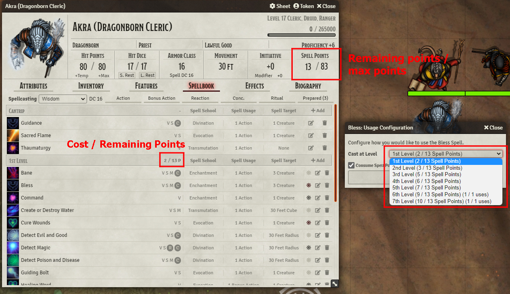
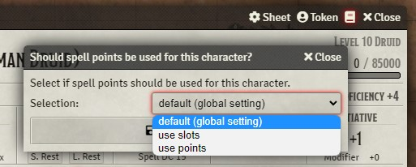
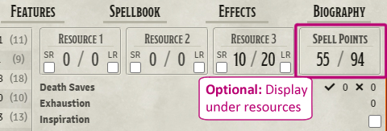

# Spell Points for dnd5e

This module implements the [Variant Spell Points Rule](https://www.dndbeyond.com/sources/dmg/dungeon-masters-workshop#VariantSpellPoints) as described in the Dungeon Master's Guide. 

* adds a spell point tracking system to every player actor
  * displays the remaining spell points etc. in the sheet header for easy access
  * shows point costs and remaining uses in the spellbook
* automatically resets spell points on long rest and consumes them when a spell is used
* works with multi-classing
* NPC's, non-spellcasters and warlocks still use spell slots

## Actor specific setting
If you want to enable or disable spell points for only a few actors, trusted players and GMs can do that by clicking on the small book icon in the sheet header (as seen in the screenshot below) and selecting between default behaviour (what the GM set in the global settings), explicitly using *spell slots* or explicitly using *spell points*. 

## Compatibility with Custom Sheets

If you are using a module that modifies the default character sheet and the remaining and max spellpoints are not shown in the header (as seen in the screenshot above), go to the settings and set it to display the spellpoints under `Resources`. That **could** fix it. 

See below for known incompatibilities!

If your sheet doesn't work and is not listed below you can open an issue, but I probably won't fix it soon, as that's not my priority. Sorry!

## Installation Instructions

> :arrow_right: [optional] Install the [libWrapper](https://foundryvtt.com/packages/lib-wrapper) module to avoid conflicts.

1. In `Configuration and Setup` go to `Add-on Modules` 
2. Click on `Install Module`
3. Paste the following URL into the `Manifest URL` text box at the bottom: 
   - https://github.com/Mary-Usagi/spellpoints5e/releases/latest/download/module.json

## TODO
- **Settings to adjust spell costs and max points per level (GM only)**
- **Localization**
- **Compatability with other modules:**
  - :red_square: **Tidy5e Sheet**: Doesn't display remaining / max spell points yet. I'm working on it, but will probably take some time. 
  - :green_square: **Compact D&D Beyond-like**: Works, just go to settings and set the display location to `Resources`
  - :yellow_square: **Combat HUD**: Works, but doesn't show spell points or uses on the HUD
